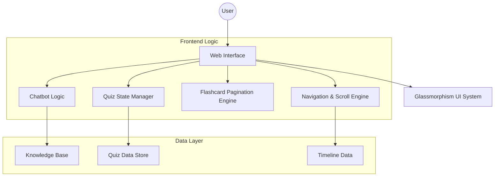

# 🗳️ Bharat Election Guru

**Bharat Election Guru** is a premium, interactive educational web application designed to help citizens understand the intricacies of the Indian Election System. Built with a focus on high-performance animations, immersive UI, and comprehensive knowledge, it serves as an end-to-end guide from voter registration to government formation.

---

## ✨ Key Features

### 📅 Interactive Election Timeline
A scroll-animated vertical timeline detailing the 10 critical steps of the Indian election process, from Delimitation to Result Declaration.

### 🃏 3D Educational Flashcards
20+ interactive 3D-flipping cards covering key terminology like EVM, VVPAT, NOTA, and Model Code of Conduct.

### 🧠 Knowledge-Check Quiz
A 15-question interactive quiz with immediate feedback, progress tracking, and performance-based scoring.

### 🤖 Smart Chat Assistant
An AI-powered chatbot with a knowledge base of 30+ complex topics, including:
- **Campaigning Rules** & Expenditure limits.
- **Vote Counting** procedures.
- **Government Formation** & Coalition politics.
- **Constitutional Roles** (President, Governor, Speaker).
- **Electoral Reforms** (One Nation One Election, VVPAT verification).

### 📚 Deep Dive Info Center
Four categorized tabs with 24 detailed content cards for granular learning about Voting Processes, Constitutional Bodies, and Key Milestones.

---

## 🛠️ Technology Stack

- **Core**: Vanilla JavaScript (ES6+), HTML5
- **Styling**: Modern CSS3 (Glassmorphism, Flexbox/Grid, CSS Variables)
- **Animations**: CSS Keyframes & Intersection Observer API
- **Icons/Fonts**: Google Fonts (Inter & Outfit)

---

## 📐 System Architecture



---

## 🚀 Deployment

### Cloud Run (Recommended)
The project is containerized and ready for Google Cloud Run.
1. **Build & Deploy:**
   ```bash
   gcloud run deploy bharat-election-guru --source . --region us-central1 --allow-unauthenticated --port 8080
   ```

### Local Setup
Simply open the `index.html` file in any modern web browser.

---

## 📸 Preview


---

## 📄 License
Educational Purposes Only. Designed for Indian Democracy Awareness. 🇮🇳
